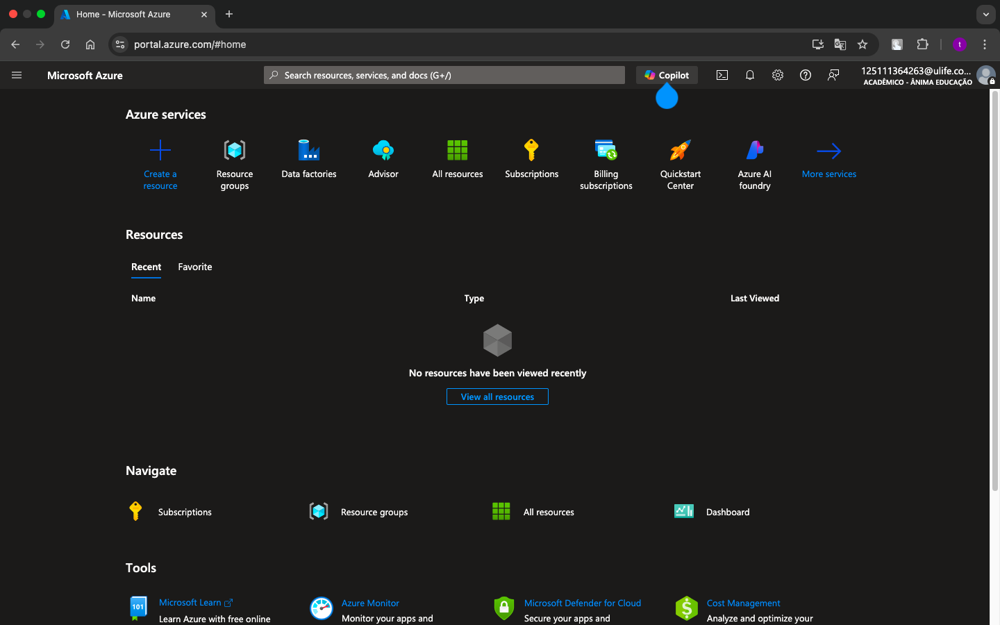
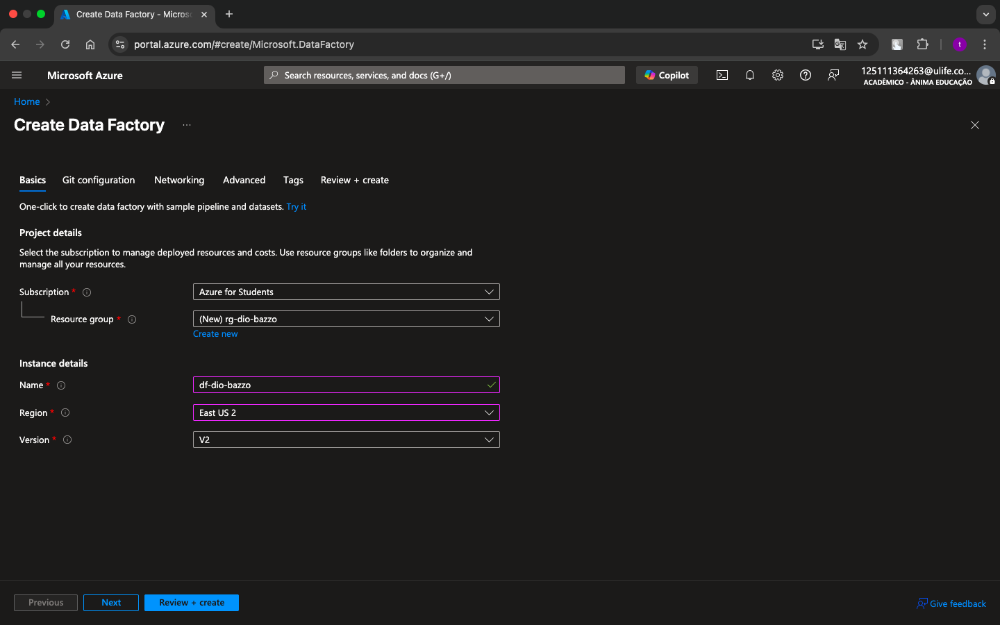
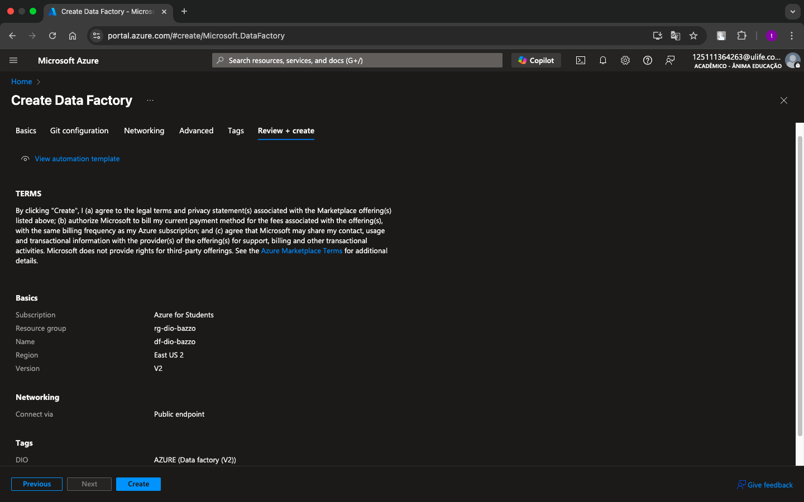
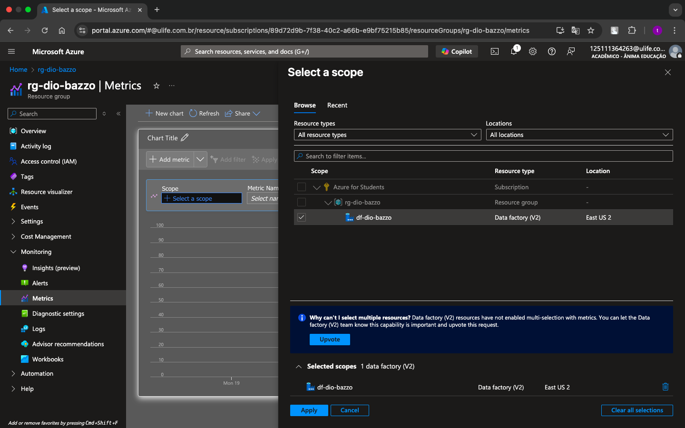
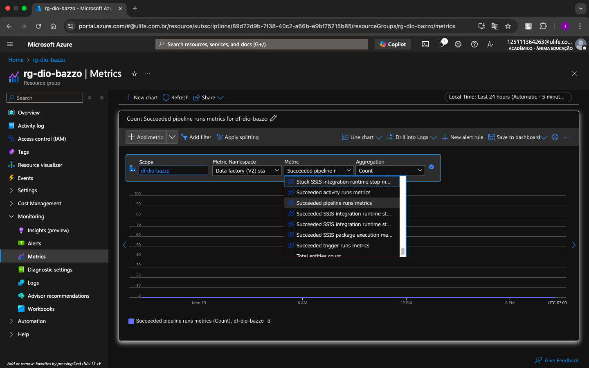
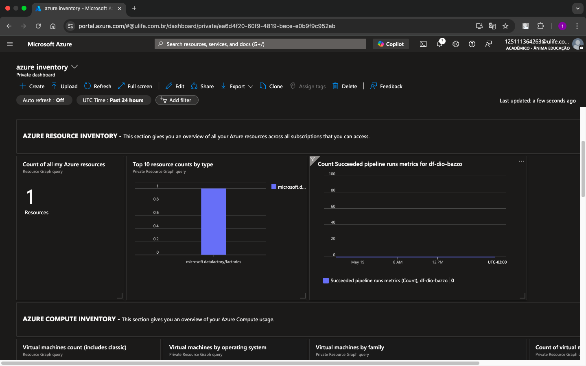

# 📘 Introdução: Como Criar uma Instância e Resource Group do Azure Data Factory

Este guia passo a passo mostrará como criar um **Resource Group** e uma **instância do Azure Data Factory** de forma correta, seguindo boas práticas de nomenclatura e organização no portal Azure.

---

## 🏗️ Etapa 1: Acessar o Portal e Criar o Data Factory

1. Na página inicial da sua conta Azure, clique em **"Data Factories"** e depois em **"Create"**.

---

## 🧾 Etapa 2: Preencher Informações do Resource Group

2. Preencha o **Resource Group** com um novo nome, ou selecione um já existente.

> 🎯 **Dica**: Siga a [nomenclatura recomendada da Microsoft](https://learn.microsoft.com/pt-br/azure/cloud-adoption-framework/ready/azure-best-practices/resource-abbreviations) para manter a padronização.

- Escolha o **nome da instância** (utilize a mesma lógica de nomenclatura).
- Selecione a **região** e a **versão** desejada.

---

## 🏷️ Etapa 3: Criar uma Tag

3. Crie uma **Tag**. Isso é extremamente importante para **categorizar e organizar** seus recursos com mais eficiência.

---

## ✅ Etapa 4: Revisar e Automatizar

4. Revise todas as configurações antes de confirmar.

> 🧙‍♂️ No canto superior esquerdo há um botão chamado **"View Automation Template"**, que gera automaticamente um **template em PowerShell** (ou outro script) com os parâmetros definidos — útil para replicar esse padrão em outras instâncias futuramente.

---

## 📊 Etapa 5: Acessar Métricas e Monitoramento

5. Após a criação, dentro do recurso do Data Factory, explore a aba **"Métricas"** para monitorar seu ambiente.

Você poderá:
- Criar **indicadores e gráficos personalizados**
- **Anexar essas métricas a Dashboards** no próprio Azure

---

## 🏁 Final

Pronto! Agora você tem seu Azure Data Factory criado, nomeado corretamente, com tags organizadas e monitoramento pronto para uso.
